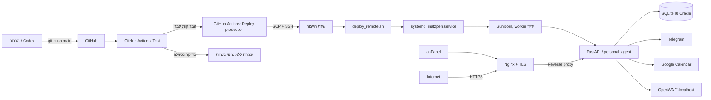
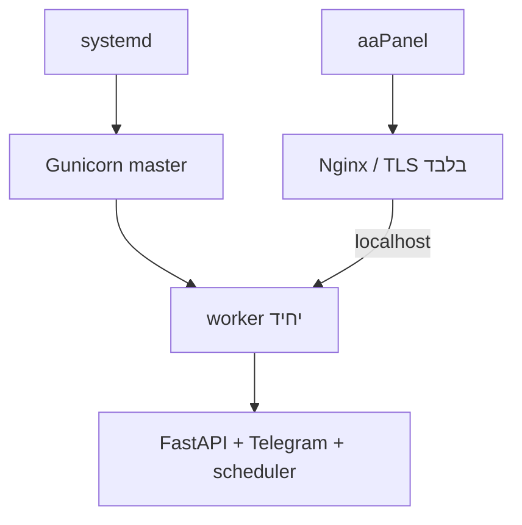
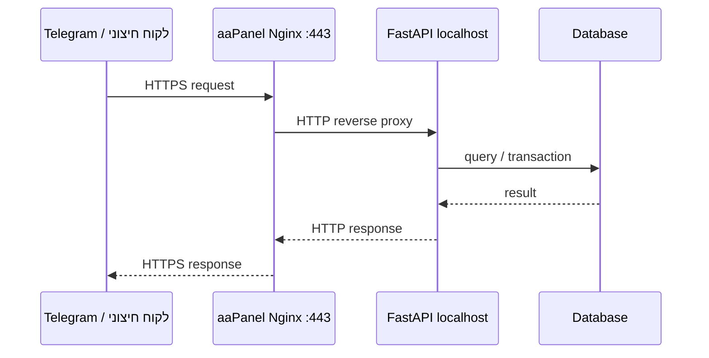
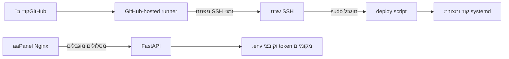

# ארכיטקטורת CI/CD ו־aaPanel של Matzpen

מסמך זה מסביר, שלב אחר שלב, כיצד שינוי בקוד עובר מהמחשב של המפתח אל שרת
הייצור, מה התפקיד של GitHub Actions, מה aaPanel מנהל, כיצד Nginx, systemd,
Gunicorn ו־FastAPI מתחברים, היכן נשמרים סודות, ואיך המערכת מגיבה לכשל.

המסמך מתאר את המימוש הקיים במאגר. המקורות המרכזיים הם:

- `.github/workflows/ci-cd.yml` — תהליך הבדיקות והפריסה ב־GitHub Actions.
- `scripts/deploy_remote.sh` — פעולות הפריסה שמתבצעות בתוך שרת הייצור.
- `scripts/bootstrap_production_service.sh` — מעבר חד־פעמי מניהול תהליך ב־aaPanel לניהול ב־systemd.
- `deploy/matzpen.service` — יחידת systemd של האפליקציה.
- `deploy/aapanel-nginx.conf` — קטע Nginx שמותקן בתוך אתר HTTPS של aaPanel.

## 1. תמונת המערכת



חלוקת האחריות היא:

| רכיב | אחריות |
| --- | --- |
| Git | שמירת היסטוריית הקוד וה־commit המדויק לפריסה |
| GitHub Actions | בדיקת הקוד, יצירת חבילת גרסה והפעלת הפריסה |
| GitHub Environment `production` | שמירת פרטי חיבור SSH ובקרת גישה לפריסה |
| aaPanel | ניהול אתר ה־HTTPS, תעודת TLS ותצורת Nginx |
| Nginx | קבלת בקשות חיצוניות והעברת מסלולים מותרים לאפליקציה המקומית |
| systemd | הפעלה, עצירה, restart והתאוששות של תהליך האפליקציה |
| Gunicorn | ניהול תהליך FastAPI בייצור |
| FastAPI | ה־API, Telegram polling, scheduler, תזכורות והאינטגרציות |
| Alembic | עדכון סכמת מסד הנתונים |

## 2. גבול האחריות בין aaPanel ל־systemd

aaPanel אינו מנהל את תהליך Matzpen לאחר ה־bootstrap. הוא מנהל את שכבת הכניסה:

- הדומיין;
- האזנה ב־`443`;
- תעודת TLS;
- חוקי Nginx;
- reverse proxy למסלולים שנבחרו.

התהליך של Matzpen עצמו מנוהל על ידי `matzpen.service` ב־systemd. ההפרדה הזו
מונעת מצב שבו aaPanel ו־systemd מפעילים במקביל שני מופעי Gunicorn. הדבר חשוב
במיוחד משום ש־Telegram long polling וה־scheduler חייבים לרוץ במופע אחד בלבד.

ב־bootstrap נעצר תהליך Gunicorn הישן שהופעל דרך aaPanel, אם קיים PID פעיל,
ולאחר מכן systemd מפעיל מופע יחיד.



## 3. מה מפעיל את ה־workflow

הקובץ `.github/workflows/ci-cd.yml` מגדיר שלושה טריגרים:

1. Pull request אל `main` — מריץ בדיקות בלבד.
2. Push אל `main` — מריץ בדיקות ולאחר הצלחה עשוי לפרוס לייצור.
3. `workflow_dispatch` — הפעלה ידנית דרך GitHub Actions.

`workflow_dispatch` יכול לפעול על ref שנבחר בממשק GitHub, ולא בהכרח על
`main`. כל עוד `CD_ENABLED=true`, גם ref ידני כזה יכול להגיע ל־job הפריסה.
אם המדיניות היא שייצור מקבל קוד מ־`main` בלבד, צריך להוסיף תנאי מפורש ל־job או
להגביל את הרשאות ההפעלה הידנית.

שלב הפריסה רץ רק כאשר שני התנאים הבאים מתקיימים:

```text
האירוע אינו pull_request
CD_ENABLED == true
```

בנוסף, job הפריסה תלוי ב־job הבדיקות באמצעות `needs: test`. לכן אי אפשר להגיע
לפריסה כאשר CI נכשל.

מוגדרת קבוצת concurrency בשם `matzpen-production` עם
`cancel-in-progress: false`. המשמעות היא שפריסות אינן מבטלות זו את זו; GitHub
ממתין ומריץ אותן לפי הסדר. גם בתוך השרת קיים lock נוסף.

## 4. שלב CI — מה נבדק לפני פריסה

GitHub יוצר runner נקי מסוג Ubuntu ומבצע:

1. checkout של ה־commit.
2. התקנת Python 3.12.
3. התקנת הפרויקט וכלי הפיתוח באמצעות `pip install -e ".[dev]"`.
4. `ruff format --check .` — בדיקה שהקבצים מעוצבים, בלי לשנות אותם.
5. `ruff check .` — lint ושגיאות קוד נפוצות.
6. `mypy src` — בדיקת טיפוסים סטטית.
7. `pytest -q` — הרצת כל הבדיקות.
8. `git diff --check` — איתור שגיאות whitespace.

כל פקודה חייבת להסתיים בקוד יציאה `0`. כשל באחת מהן עוצר את ה־workflow, ו־job
הפריסה לא מתחיל.

## 5. הסודות וההרשאות ב־GitHub

הפריסה משתמשת ב־GitHub Environment בשם `production`. בתוכו נדרשים:

| שם | משמעות |
| --- | --- |
| `DEPLOY_HOST` | כתובת IP או hostname של השרת |
| `DEPLOY_PORT` | פורט SSH, בדרך כלל `22` |
| `DEPLOY_USER` | משתמש הפריסה בשרת |
| `DEPLOY_SSH_KEY` | מפתח Ed25519 פרטי של משתמש הפריסה |
| `DEPLOY_KNOWN_HOSTS` | מפתח המארח המאומת של השרת |
| `CD_ENABLED` | משתנה, לא סוד; חייב להיות `true` כדי לאפשר פריסה |

`DEPLOY_KNOWN_HOSTS` חשוב משום שהוא מונע מ־SSH להתחבר לשרת מתחזה. צריך ליצור
אותו באמצעות `ssh-keyscan`, ולאמת את ה־fingerprint מול השרת עצמו לפני ששומרים
אותו ב־GitHub.

ל־workflow יש הרשאת GitHub מינימלית של `contents: read`. הסודות זמינים רק ל־job
של סביבת `production`, ואינם נכתבים למאגר.

עם זאת, הרשאת GitHub המצומצמת אינה מצמצמת את הרשאות הקוד בשרת. קוד שמגיע ל־job
הפריסה יכול לרוץ בפועל כ־root: סקריפט הפריסה מריץ `pip install`, מיגרציות ופקודות
systemd. גם שינוי בקובץ workflow יכול להשפיע על אופן השימוש בסודות. לכן ההגנות
המרכזיות הן branch protection, ביקורת קוד, required reviewers לסביבת
`production`, ו־CODEOWNERS עבור `.github/workflows/**` ו־`scripts/deploy_remote.sh`.

משתמש הפריסה צריך הרשאת `sudo` מצומצמת להפעלת סקריפט הפריסה בלבד. הוא אינו צריך
גישה כללית ללא סיסמה לכל פקודת root.

ה־workflow משתמש ב־Actions עם תגיות major כגון `actions/checkout@v4` ו־
`actions/setup-python@v5`. לחיזוק שרשרת האספקה אפשר להצמיד אותן ל־commit SHA
מלא. גם התלויות מותקנות מטווחי גרסאות ללא hashes; שינוי עתידי יכול להחליף את
הגרסה שתותקן אף כשהקוד לא השתנה.

## 6. בניית חבילת הגרסה

לאחר שהבדיקות עברו, GitHub יוצר archive מה־commit שנבדק:

```text
matzpen-<GITHUB_SHA>.tar.gz
```

החבילה נוצרת באמצעות `git archive HEAD`, ולכן היא כוללת רק קבצים שנמצאים
ב־commit. קבצים ששונו מקומית ולא בוצע להם commit אינם נכללים בפריסה.

שם הקובץ כולל SHA מלא בן 40 תווים. אותו SHA נשלח גם כפרמטר לסקריפט בשרת, כדי
לקשור בין הקוד שנבדק לבין הקוד שנפרס.

## 7. העברת החבילה לשרת

GitHub Actions מבצע את השלבים הבאים:

1. יוצר `~/.ssh` בהרשאה `700`.
2. כותב את מפתח הפריסה ל־`id_ed25519` בהרשאה `600`.
3. כותב את `DEPLOY_KNOWN_HOSTS` לקובץ `known_hosts` בהרשאה `600`.
4. מעביר ב־SCP אל `/tmp` בשרת:
   - את archive הגרסה;
   - את `scripts/deploy_remote.sh`.
5. מתחבר ב־SSH ומריץ את הסקריפט.

אם משתמש ה־SSH הוא root, הסקריפט מופעל ישירות. אחרת הוא מופעל באמצעות `sudo`.

## 8. מבנה הקבצים בשרת

הנתיבים הנוכחיים הם:

| שימוש | נתיב |
| --- | --- |
| קוד הייצור | `/www/wwwroot/Mazpen` |
| Python של הייצור | `/www/server/pyporject_evn/Mazen/bin/python3.12` |
| Gunicorn | `/www/server/pyporject_evn/Mazen/bin/gunicorn` |
| קובץ PID | `/www/wwwroot/Mazpen/src/gunicorn.pid` |
| גיבויים | `/www/backup/Mazpen` |
| יחידת systemd | `/etc/systemd/system/matzpen.service` |
| קובץ סודות של האפליקציה | `/www/wwwroot/Mazpen/.env` |

האיות `Mazpen` ו־`Mazen` בנתיבים הוא חלק מהתצורה הקיימת. אין לתקן אותו בלי
מיגרציה מתוכננת, משום שהסקריפטים מבצעים בדיקות קשיחות על הנתיבים.

יחידת systemd אינה מגדירה `EnvironmentFile`. האפליקציה קוראת את `.env` מתוך
`WorkingDirectory`, באמצעות מנגנון ההגדרות של האפליקציה. המשתנה `APP_PORT`
ב־`.env` אינו בהכרח הפורט של Gunicorn תחת systemd; מקור האמת עבור ה־bind הוא
`src/gunicorn_conf.py` שנמצא רק בשרת.

## 9. מה עושה `deploy_remote.sh`

### 9.1 אימות מוקדם

הסקריפט רץ עם `set -Eeuo pipefail`, ולכן שגיאות, משתנים חסרים וכשלים בתוך pipeline
עוצרים אותו. לפני שינוי השרת הוא מאמת:

- ש־`DEPLOY_ROOT` הוא בדיוק `/www/wwwroot/Mazpen`;
- ששם ה־archive תואם ל־SHA מלא;
- שה־SHA שהתקבל תקין;
- שקובץ ה־archive קיים;
- שקובץ Python ניתן להרצה;
- שקובץ PID של Gunicorn קיים.

### 9.2 נעילת פריסה

הסקריפט נועל את `/www/backup/Mazpen/deploy.lock` באמצעות `flock -n`. אם פריסה
אחרת כבר פועלת, הפריסה החדשה נכשלת במקום להריץ שתי החלפות קוד במקביל.

זוהי שכבת הגנה נוספת מעבר ל־concurrency של GitHub.

### 9.3 staging ובדיקת החבילה

נוצרת תיקיית staging זמנית תחת `/tmp`, וה־archive נפתח לתוכה. לפני המשך הפריסה
נבדקת נוכחותם של קבצים מרכזיים:

- `pyproject.toml`;
- `alembic.ini`;
- `src/personal_agent/main.py`;
- `scripts/deploy_remote.sh`.

לאחר מכן מתבצע `compileall` לקוד החדש לפני שהוא מועתק לעץ הייצור.

### 9.4 גיבוי הגרסה הנוכחית

הגיבוי נכתב אל:

```text
/www/backup/Mazpen/<UTC timestamp>-<commit SHA>/
```

הוא כולל archive של קוד האפליקציה, עותק של `gunicorn_conf.py` וקובץ
`revision.txt`. מהגיבוי מוחרגים בכוונה:

- `.env`;
- קובצי SQLite;
- `data/`;
- `logs/`;
- `__pycache__/`.

הסיבה היא שסודות ומידע תפעולי נשארים בשרת ואינם מועתקים כחלק מגיבוי הקוד.

החרגות הגיבוי אינן רשימה כללית של כל סוגי האישורים. לדוגמה, תיקיית `secrets/`
או קובצי OAuth JSON במיקום אחר בתוך עץ האפליקציה אינם מוחרגים אוטומטית. לכן
עדיף לשמור קובצי credentials מחוץ לעץ הקוד או להוסיף להם החרגה מפורשת לאחר
מיפוי הנתיבים. הגיבוי נשמר בתיקייה בהרשאה `700`, אך עדיין צריך לבדוק את תוכנו
ואת מדיניות השמירה שלו.

### 9.5 התקנת תלויות והעתקת הקוד

הסקריפט מתקין את החבילה החדשה באותה סביבת Python של הייצור. לאחר מכן הוא מריץ
`rsync` אל `/www/wwwroot/Mazpen` תוך החרגה של:

- `.env` — כדי לא לדרוס סודות וערכי production;
- `src/gunicorn_conf.py` — משום שזהו קובץ תצורה ייחודי לשרת.

הקוד תחת `src/personal_agent` והמיגרציות מקבלים בעלות `root:root`.

### 9.6 עדכון מסד הנתונים

מתוך תיקיית הייצור מופעל:

```text
python3.12 -m alembic upgrade head
```

הפקודה מקדמת את מסד הנתונים לגרסה האחרונה של המיגרציות לפני restart של השירות.

### 9.7 הבטחת worker יחיד

הסקריפט מחפש ב־`src/gunicorn_conf.py` שורה מהצורה `workers = N` ומחליף אותה
ל־`workers = 1`. אם השורה אינה קיימת בפורמט המצופה, הפריסה נעצרת.

worker יחיד נדרש כדי שלא יהיו שני Telegram pollers ושני schedulers שפועלים על
אותם נתונים ושולחים פעולות כפולות.

### 9.8 restart ובדיקות בריאות

הסקריפט מוודא ש־`matzpen.service` מותקן, ואז מבצע restart מלא. restart מלא נבחר
במקום reload כדי שלא תהיה חפיפה זמנית בין pollers ישנים וחדשים.

לאחר מכן הוא:

1. ממתין עד 30 ניסיונות, בהפרש שתי שניות, ל־`/health/live`.
2. דורש תשובת הצלחה מ־`/health/live`.
3. דורש תשובת הצלחה מ־`/health/ready`.
4. בודק שהשירות active ב־systemd.
5. מוצא את PID ה־master של systemd.
6. דורש child process אחד בדיוק.
7. כותב את ה־SHA אל `.deployed-revision`.

`/health/live` מוכיח שהאפליקציה מגיבה. `/health/ready` מריץ `SELECT 1` ומוכיח
שהאפליקציה יכולה לדבר עם מסד הנתונים.

הבדיקות אינן מוכיחות לבדן ש־Telegram, Google Calendar, Gemini או OpenWA זמינים.
אימות של האינטגרציות האלה דורש smoke test נפרד אחרי הפריסה.

## 10. האתחול החד־פעמי של systemd

לפני שמפעילים CD בפעם הראשונה מריצים כ־root:

```bash
cd /www/wwwroot/Mazpen
bash scripts/bootstrap_production_service.sh
```

הסקריפט:

1. מוודא שהוא רץ כ־root.
2. מוודא שקיימים `deploy/matzpen.service` ו־`src/gunicorn_conf.py`.
3. כופה `workers = 1`.
4. מתקין את unit file ב־`/etc/systemd/system/matzpen.service`.
5. מריץ `systemctl daemon-reload`.
6. עוצר תהליך Gunicorn ישן שהופעל דרך aaPanel, אם הוא עדיין פעיל.
7. מפעיל ומאפשר עלייה אוטומטית באמצעות `systemctl enable --now`.
8. בודק live, ready, מצב systemd ומספר workers.

לאחר שלב זה aaPanel נשאר אחראי על Nginx ו־TLS, ו־systemd אחראי על מחזור החיים
של האפליקציה.

## 11. מסלול בקשה דרך aaPanel

תבנית `deploy/aapanel-nginx.conf` מודבקת בתוך בלוק `server {}` של אתר HTTPS
ייעודי ב־aaPanel. aaPanel מחזיק את הגדרות `listen`, הדומיין והתעודה.



המסלולים הציבוריים בתבנית הם:

| מסלול | גישה | יעד |
| --- | --- | --- |
| `/api/webhooks/openwa` | `POST` בלבד | FastAPI ב־localhost |
| `/health/live` | ציבורי | FastAPI ב־localhost |
| `/health/ready` | ציבורי | FastAPI ב־localhost |
| `/api/status` | חסום באמצעות `deny all` | אינו ציבורי |
| כל מסלול אחר | `404` | אינו מועבר לאפליקציה |

התבנית מעבירה `Host`, כתובת לקוח ו־`X-Forwarded-Proto`. עבור webhook מוגדרים
גם timeout קצר, buffering וגודל גוף מרבי של `2m`.

OpenWA עצמו מאזין ב־`127.0.0.1:2785` ואינו נחשף דרך ה־vhost. גם Swagger,
dashboard ומסלולי FastAPI שאינם נדרשים אינם מפורסמים.

## 12. נקודת תצורה חשובה: פורט 8000 מול 8080

במצב הנוכחי קיימים שני defaults שונים:

- `deploy/aapanel-nginx.conf` מעביר ל־`127.0.0.1:8000`.
- סקריפטי bootstrap והפריסה בודקים כברירת מחדל את `127.0.0.1:8080`.

`src/gunicorn_conf.py` אינו tracked במאגר; הוא קובץ שרת שנשמר בין פריסות. לכן
המאגר לבדו אינו מוכיח על איזה פורט Gunicorn מאזין בפועל.

חייבים לוודא שכל שלושת המקומות תואמים:

1. `bind` בתוך `/www/wwwroot/Mazpen/src/gunicorn_conf.py`.
2. `proxy_pass` באתר Nginx של aaPanel.
3. כתובות `MATZPEN_LIVE_URL` ו־`MATZPEN_READY_URL`, או ברירות המחדל בסקריפטים.

בדיקה בשרת:

```bash
sudo systemctl cat matzpen.service
sudo grep -E '^(bind|workers)\s*=' /www/wwwroot/Mazpen/src/gunicorn_conf.py
sudo ss -lntp | grep -E ':(8000|8080)\b'
curl --fail http://127.0.0.1:8000/health/live
curl --fail http://127.0.0.1:8080/health/live
```

אם Gunicorn מאזין ב־8080, יש לעדכן את `proxy_pass` ב־aaPanel ל־8080. אם Gunicorn
מאזין ב־8000, יש לעדכן את בדיקות הפריסה ל־8000 באמצעות תצורה קבועה ומבוקרת.

העובדה שפריסת CI/CD מצליחה מוכיחה שהפורט של בדיקות הבריאות זמין; היא אינה
מוכיחה אוטומטית שה־vhost של aaPanel מפנה לאותו פורט.

## 13. rollback — מה חוזר ומה אינו חוזר

כל שגיאה לאחר התקנת ה־trap מפעילה rollback. הסקריפט:

1. מחזיר את archive של קוד האפליקציה מהגיבוי.
2. מחזיר את `gunicorn_conf.py`.
3. מפעיל מחדש את `matzpen.service` אם כבר בוצע restart.
4. מוחק את staging ואת הקבצים הזמניים תחת `/tmp`.

מגבלות חשובות:

- Alembic migrations אינן מוחזרות אוטומטית לאחור.
- חבילות Python שהותקנו בסביבה אינן מוחזרות לגרסאות הקודמות.
- `rsync` אינו משתמש ב־`--delete`, ולכן קבצים ישנים שאינם קיימים בגרסה החדשה
  עלולים להישאר בשרת.
- שחזור archive הוא overlay ואינו מוחק בהכרח קבצים חדשים שנוצרו במהלך פריסה.
- כשל אחרי שליחת חלק מהודעות Telegram יכול לגרום לניסיון חוזר ולכפילות חלקית.

לכן migration מסוכן או שינוי תלות משמעותי צריכים תכנית rollback מפורשת וגיבוי
מסד נתונים מתאים, מעבר ל־rollback האוטומטי של הקוד.

## 14. קבצים שנשמרים בין פריסות

הפריסה אינה דורסת:

- `.env` — מפתחות API, Telegram, Google, מסד נתונים והגדרות production;
- `src/gunicorn_conf.py` — bind, לוגים ותצורת Gunicorn של השרת;
- מסדי נתונים וקובצי `data/`;
- קובצי token ו־credentials שאינם ב־Git ונמצאים בנתיבים שאליהם `.env` מפנה.

GitHub מחזיק רק את סודות חיבור הפריסה. סודות האפליקציה עצמה נשארים בשרת.

## 15. גבולות אמון ואבטחה



עקרונות ההגנה הקיימים:

- מפתח מארח SSH מוצמד ב־`known_hosts`.
- GitHub Actions מקבל `contents: read` בלבד.
- סביבת `production` מרכזת secrets ויכולה לדרוש approval ידני.
- נתיב הייצור מאומת באופן קשיח.
- archive ושם commit מאומתים.
- שתי שכבות מונעות פריסות מקבילות.
- `.env` אינו ב־Git ואינו מועתק בגיבוי הקוד.
- OpenWA, `/api/status` ושאר מסלולי FastAPI אינם נחשפים ציבורית.
- worker יחיד מונע polling כפול.

## 16. התקנה ראשונה — checklist

1. להכין את `/www/wwwroot/Mazpen` בשרת.
2. ליצור סביבת Python בנתיב המצופה ולהתקין Gunicorn.
3. ליצור `.env` של production עם הרשאות מצומצמות.
4. ליצור `src/gunicorn_conf.py` ולבחור פורט bind אחד.
5. להדביק את תצורת Nginx בתוך אתר HTTPS ב־aaPanel וליישר את `proxy_pass` לפורט.
6. לוודא שתעודת TLS והדומיין פעילים.
7. להריץ `bootstrap_production_service.sh` כ־root.
8. לוודא `systemctl status matzpen.service` ו־worker יחיד.
9. ליצור משתמש SSH ייעודי ומפתח Ed25519.
10. לצמצם את הרשאת sudo להפעלת סקריפט הפריסה בלבד.
11. לאמת ולשמור את host key ב־`DEPLOY_KNOWN_HOSTS`.
12. ליצור GitHub Environment בשם `production`.
13. להוסיף את חמשת סודות ה־SSH.
14. להגדיר `CD_ENABLED=true` רק לאחר שכל הבדיקות הידניות עברו.
15. להפעיל `workflow_dispatch` ולוודא את כל שלבי ה־CI וה־CD.
16. לבצע בדיקת HTTPS חיצונית ובדיקת Telegram/Calendar ידנית.

## 17. פריסה שוטפת — רצף מלא

```mermaid
sequenceDiagram
    participant Dev as Developer
    participant GitHub as GitHub
    participant CI as Test job
    participant CD as Deploy job
    participant Host as Production host
    participant Systemd as systemd
    participant App as Matzpen

    Dev->>GitHub: push commit to main
    GitHub->>CI: start clean runner
    CI->>CI: format, lint, mypy, pytest
    alt tests failed
        CI-->>Dev: failed; no deployment
    else tests passed
        CI->>CD: allow deploy job
        CD->>CD: git archive tested SHA
        CD->>Host: SCP archive + deploy script
        CD->>Host: SSH / sudo deploy_remote.sh
        Host->>Host: validate + lock + backup
        Host->>Host: pip install + rsync + Alembic
        Host->>Systemd: restart matzpen.service
        Systemd->>App: start Gunicorn, one worker
        Host->>App: live + ready checks
        alt verification failed
            Host->>Host: restore code backup
            Host->>Systemd: restart previous code
            Host-->>CD: non-zero exit
        else verification passed
            Host->>Host: write .deployed-revision
            Host-->>CD: success
            CD-->>Dev: workflow green
        end
    end
```

## 18. תפעול ואבחון תקלות

### מצב השירות והלוגים

```bash
sudo systemctl status matzpen.service
sudo journalctl -u matzpen.service -n 200 --no-pager
sudo journalctl -u matzpen.service -f
```

### תהליכים ו־workers

```bash
MASTER_PID="$(systemctl show --property=MainPID --value matzpen.service)"
ps -fp "$MASTER_PID"
pgrep -a -P "$MASTER_PID"
```

צריך להיות worker אחד בלבד.

### בדיקות מקומיות בשרת

```bash
curl --fail http://127.0.0.1:8080/health/live
curl --fail http://127.0.0.1:8080/health/ready
cat /www/wwwroot/Mazpen/.deployed-revision
```

יש להתאים את הפורט ל־bind בפועל.

### בדיקת Nginx של aaPanel

```bash
sudo nginx -t
sudo ss -lntp | grep -E ':(443|8000|8080)\b'
```

בנוסף יש לבצע בקשה אל הדומיין הציבורי:

```bash
curl --fail https://<domain>/health/live
curl --fail https://<domain>/health/ready
```

### זיהוי הגרסה שנפרסה

משווים בין:

```bash
cat /www/wwwroot/Mazpen/.deployed-revision
```

לבין ה־SHA של ה־workflow ב־GitHub Actions.

### גיבויים

```bash
sudo ls -la /www/backup/Mazpen
sudo cat /www/backup/Mazpen/<backup-directory>/revision.txt
```

אין למחוק גיבויים לפני שמוודאים שהגרסה החדשה, מסד הנתונים והאינטגרציות פועלים.

## 19. מה workflow ירוק מוכיח

Workflow ירוק מוכיח ש:

- הקוד שנדחף עבר את בדיקות המאגר;
- אותו commit נארז והועבר לשרת;
- סקריפט הפריסה הסתיים בלי שגיאה;
- האפליקציה ענתה לבדיקות live ו־ready המקומיות;
- מסד הנתונים ענה ל־`SELECT 1`;
- systemd דיווח שהשירות פעיל;
- נמצא worker אחד;
- נכתב SHA הפריסה.

הוא אינו מוכיח ש:

- הדומיין הציבורי ו־TLS תקינים;
- ה־proxy של aaPanel מצביע לפורט הנכון;
- Telegram polling מקבל הודעות בפועל;
- Google Calendar יכול לקרוא ולכתוב;
- Gemini ושאר ספקי ה־LLM זמינים;
- OpenWA מחובר ל־WhatsApp;
- scheduler ישלח הודעה עתידית בזמן הנכון.

לכן אחרי שינוי משמעותי צריך smoke test חיצוני של המסלול שנגע בו השינוי.

## 20. המלצות להמשך

1. לבחור פורט production יחיד וליישר את Gunicorn, aaPanel ובדיקות הפריסה.
2. להוסיף smoke test חיצוני ל־HTTPS אחרי הפריסה.
3. להוסיף בדיקת readiness לא פולשנית של Telegram והאינטגרציות הנדרשות.
4. לתכנן rollback למיגרציות מסד נתונים לפני migration שאינו backward-compatible.
5. לשקול סביבת Python גרסתית לכל release במקום התקנה לתוך venv משותף.
6. לשקול `rsync --delete` עם רשימת החרגות מדויקת, לאחר בדיקה שלא נמחקים קובצי runtime.
7. להוסיף מדיניות retention אוטומטית לגיבויים.
8. להגן על GitHub Environment באמצעות required reviewers כאשר נדרשת בקרת שינוי.
9. להוסיף CODEOWNERS והגנת ענף לקובצי workflow וסקריפטי הפריסה.
10. להצמיד GitHub Actions ל־SHA ולבחון lock/hashes לתלויות production.

## 21. מסלול ידני נפרד שאינו חלק מ־CI/CD

`scripts/create_deployment_bundle.py` הוא כלי אריזה ידני ונפרד. GitHub Actions
אינו משתמש בו. אין לערבב בינו לבין המסלול האוטומטי שמתואר במסמך זה.

הכלי הידני עשוי לכלול את תיקיית `secrets/` המקומית בתוך החבילה שהוא יוצר, ולכן
צריך להשתמש בו רק מתוך סביבת עבודה מבוקרת, לבדוק את תוכן החבילה ולא להעביר אותה
ליעד שאינו מורשה. המסלול האוטומטי מבוסס `git archive`, ולכן כולל רק קבצים
tracked מה־commit ואינו אוסף אוטומטית קבצים מקומיים לא־tracked.

